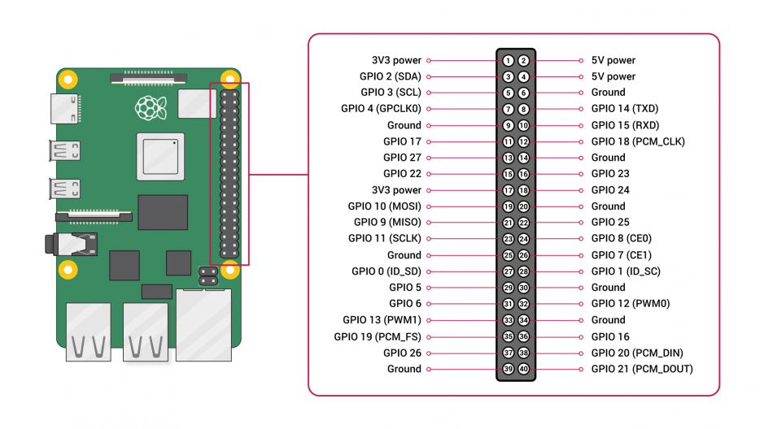

## Projektowanie Elektrycznych Układów Sterowania (PEUS)

### Opis działania
Lorem ipsum dolor sit amet, consectetur adipiscing elit, sed do eiusmod tempor incididunt ut labore et dolore magna aliqua. Ut enim ad minim veniam, quis nostrud exercitation ullamco laboris nisi ut aliquip ex ea commodo consequat. Duis aute irure dolor in reprehenderit in voluptate velit esse cillum dolore eu fugiat nulla pariatur. Excepteur sint occaecat cupidatat non proident, sunt in culpa qui officia deserunt mollit anim id est laborum.

### Konfiguracja Systemu:  
```sudo apt-get update```  
```sudo apt-get upgrade```  
```sudo apt-get install qtbase5-dev libqt5webkit5-dev libqt5websockets5-dev```    

#### WiringPI:    
```sudo apt-get install libi2c-dev i2c-tools```    
```wget https://project-downloads.drogon.net/wiringpi-latest.deb```    
```sudo dpkg -i wiringpi-latest.deb```  
```gpio -v```  

#### Enable I2C in Raspberry Pi:   
```sudo raspi-config```    
Interface Options -> I2C -> Yes    
 
#### IDE:  
```sudo apt-get install qtcreator```  

### Hardware:

Komenda na sprawdzenie wartości portów w linuxie do odwołania się w programie.  
```gpio readall```  

Zdjęcie portów raspberry pi 4
  

#### Podłączenie czujników  
Zdjęcie podłączonego czujnika BME280 raspberry pi  
Zdjecie podłączenia czujnika krańcowego

### Schemat blokowy programu

`` print("Hello World") ``  
```` print("Hello World") ````  

from sensor import DS18B20

ds = DS18B20('28-XXXXXXXXXXXX')
t = ds.temperature()  # read temperature

print(t)    # this is a namedtuple
print(t.C)  # Celcius
print(t.F)  # Fahrenheit
print(t.K)  # Kelvin

### Bibliografia:  
https://roboticsbackend.com/wiringpi-i2c-tutorial-rasperry-pi-adxl345/  
https://github.com/andreiva/raspberry-pi-bme280  
