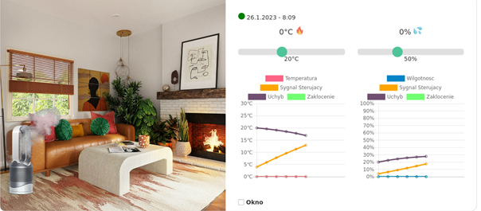

## Projektowanie Elektrycznych Układów Sterowania (PEUS)

### Description
Smart home project written in C++ using Raspberry Pi 4 microcomputer. The project was carried out as part of the PEUS course. We used a temperature, humidity, and pressure BME280 sensor and a switch to check the state of the window as peripheral devices. The whole was created using the Qt framework. The code works as a local Server and Client. The Client is in the form of a stripped-down browser version, and the entire graphical interface was written using Javascript, HTML, and CSS. User communication with the entire device is provided through WebSocket technology. Additionally, the application allows data collection to the database, which in our case was MariaDB.   


### System configuration:  
To use above program we need to install/update required libraries for the project by doing the steps below.

#### Libraries to install
#### Qt5 :
```sudo apt-get update```  
```sudo apt-get upgrade```  
```sudo apt-get install qtbase5-dev libqt5webkit5-dev libqt5websockets5-dev libqt5sql5-mysql```

#### WiringPI:    
```sudo apt-get install libi2c-dev i2c-tools```    
```wget https://project-downloads.drogon.net/wiringpi-latest.deb```    
```sudo dpkg -i wiringpi-latest.deb```  
```gpio -v```  

#### IDE:  
```sudo apt-get install qtcreator```  

In our project we used two-way bus I2C which we need to enable
#### Enable I2C in Raspberry Pi:   
```sudo raspi-config```    
Interface Options -> I2C -> Yes    

### Hardware:
Check the values of ports in linux to know what to input in program
```gpio readall```

Picture of Raspberry Pi 4
  

### Bibliography:
https://roboticsbackend.com/wiringpi-i2c-tutorial-rasperry-pi-adxl345/  
https://github.com/andreiva/raspberry-pi-bme280  
